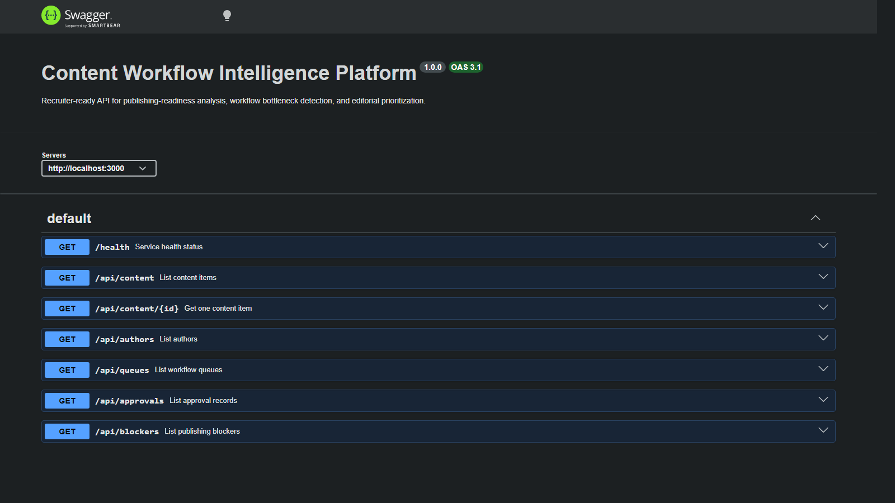
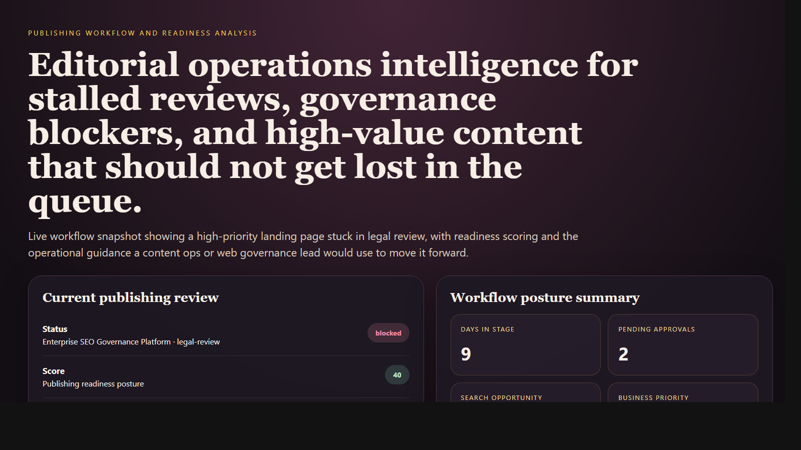
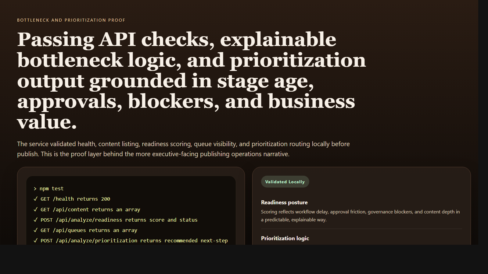

# Content Workflow Intelligence Platform

> **TypeScript portfolio project** demonstrating publishing-readiness scoring, editorial bottleneck visibility, content operations governance, and workflow-aware backend decisioning for enterprise teams.

**Recruiter takeaway:** *"This person understands content operations, SEO governance, and publishing systems as coordinated enterprise workflows, not isolated tasks."*

---

## Project Overview

| Attribute | Detail |
|---|---|
| **Runtime** | Node.js + TypeScript |
| **Framework** | Express 5 |
| **Domain** | Content operations, publishing governance, editorial workflow intelligence |
| **Signal Areas** | Workflow age · Approval friction · Governance blockers · Search opportunity · Business priority |
| **Operational Outputs** | Readiness posture · Bottleneck analysis · Prioritization routing |
| **Docs** | Swagger UI at `/docs` |

---

## Executive Summary

Content Workflow Intelligence Platform models the kind of internal service enterprise editorial, SEO, legal, compliance, and web platform teams use to move high-value content through publishing workflows with less friction and better visibility. Instead of acting like a CMS clone, the API focuses on operational readiness: where content is stuck, which teams are causing queue drag, how business priority and search upside should influence routing, and what next action an operator should take.

The result is a recruiter-facing backend project that feels like a real internal publishing operations system rather than a generic content app.

---

## Business Problem

Enterprise publishing breaks down when content, SEO, legal, compliance, and platform teams operate in separate queues without a shared operational view. High-value assets can sit in review too long, approvals get lost, schema and governance issues stay unresolved, and priority content misses the window where it would have the most business impact.

---

## Solution

This API turns publishing workflow state into decision support. It models content items, authors, queues, approvals, blockers, and performance signals, then returns:

- publishing readiness scores
- workflow bottleneck analysis
- prioritization routing
- dashboard-level operational summaries

---

## Architecture

```text
Content item or workflow scenario
    |
    v
POST /api/analyze/*
    |
    +--> Request validation
    +--> Stage age and queue review
    +--> Approval and blocker analysis
    +--> Search opportunity and business priority weighting
    |
    v
Workflow posture
    |
    +--> ready
    +--> needs-review
    +--> blocked
```

### Workflow Explanation

1. Teams submit a workflow scenario or query current content inventory and queues.
2. The service validates request shape with Zod.
3. Readiness logic reviews stage age, pending approvals, blockers, content depth, search opportunity, and business priority.
4. The service returns a score, issues, passed checks, and a recommended next action.
5. Operators use dashboard, blocker, and queue views to unblock publishing and protect high-value assets.

---

## API Endpoints

| Method | Endpoint | Purpose |
|---|---|---|
| `GET` | `/health` | Service status and uptime |
| `GET` | `/api/content` | List content items |
| `GET` | `/api/content/:id` | Fetch one content item |
| `GET` | `/api/authors` | List authors |
| `GET` | `/api/queues` | List workflow queues |
| `GET` | `/api/approvals` | List approval records |
| `GET` | `/api/blockers` | List publishing blockers |
| `GET` | `/api/dashboard/summary` | Workflow operations summary |
| `POST` | `/api/analyze/readiness` | Analyze publishing readiness |
| `POST` | `/api/analyze/bottleneck` | Analyze workflow bottlenecks |
| `POST` | `/api/analyze/prioritization` | Analyze prioritization routing |

---

## Sample Readiness Request

```json
{
  "title": "Enterprise SEO Governance Platform",
  "stage": "legal-review",
  "daysInStage": 9,
  "requiredApprovalsPending": 2,
  "blockingIssues": ["missing-schema-review", "legal-copy-approval"],
  "searchOpportunityScore": 84,
  "businessPriority": "high",
  "wordCount": 1180
}
```

## Sample Readiness Response

```json
{
  "status": "blocked",
  "score": 40,
  "issues": [
    "Content has remained in the current stage beyond the expected workflow SLA.",
    "Required approvals are still pending.",
    "Blocking governance issues remain unresolved for this content item.",
    "Legal review is a likely throughput bottleneck for this asset.",
    "Schema review remains unresolved for a high-priority asset."
  ],
  "passedChecks": [
    "Search opportunity supports continued prioritization.",
    "Content depth is sufficient for target topic competitiveness.",
    "Business priority justifies active workflow escalation if blocked."
  ],
  "recommendedNextAction": "Escalate approval path and route schema or legal review to the owning governance team this sprint."
}
```

---

## Screenshots

### Hero Capture



### Publishing Workflow and Readiness Analysis



### Bottleneck and Prioritization Proof



---

## Getting Started

### Prerequisites

- Node.js 20+
- npm

### Setup

```bash
git clone https://github.com/mizcausevic-dev/content-workflow-intelligence-platform.git
cd content-workflow-intelligence-platform
npm install
cp .env.example .env
npm run dev
```

Visit:

- `http://localhost:3000/docs`
- `http://localhost:3000/api/content`
- `http://localhost:3000/api/dashboard/summary`

### Run Tests

```bash
npm test
```

---

## What This Demonstrates

- content operations translated into backend service logic
- editorial workflow visibility and throughput thinking
- governance-aware publishing readiness analysis
- prioritization based on business value and search opportunity
- production-minded TypeScript API structure with docs, tests, and operational summaries

---

## Future Enhancements

- persist workflow entities in PostgreSQL
- connect CMS and approval-system webhooks
- add queue SLA tracking by team and stage
- add publish calendar coordination and release windows
- integrate content performance history and inventory health scoring

---

## Tech Stack


### Portfolio Links

- [LinkedIn](https://www.linkedin.com/in/mirzacausevic)
- [Skills Page](https://mizcausevic.com/skills/)
- [Medium](https://medium.com/@mizcausevic)
- [GitHub](https://github.com/mizcausevic-dev)

---

*Part of [mizcausevic-dev's GitHub portfolio](https://github.com/mizcausevic-dev) — demonstrating enterprise publishing systems thinking, workflow governance, and backend decision support for content operations.*
